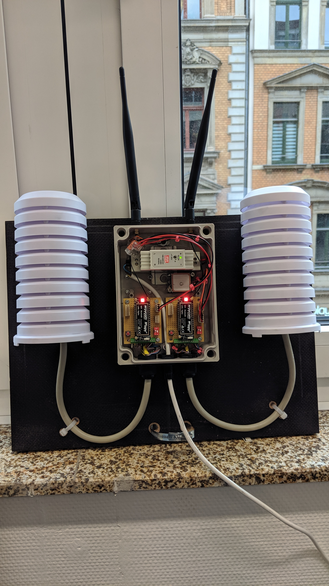

### Node_v1

#### Sensor Overview

| #   | Name              | Type                    | Values                                          |
| --- | ----------------- | ----------------------- | ----------------------------------------------- |
| 1   | Plantower PMS7005 | Air Quality Sensor      | pm1- / pm25- / pm100-concentration              |
| 2   | BME280            | Humidity Sensor         | humidity, barometric pressure, temperature      |
| 3   | MiCS-6814         | Multichannel Gas Sensor | CO, NO2, C2H5OH, H2, NH3, CH4, C3H8, C4H10      |
| 4   | GY-NEO6MV2        | GPS Module              | longitude, latitude, altitude, speed, date/time |

#### Parts List

| Qty | Article                             | Description                | Source                                                                                                                                                 |
| --- | ----------------------------------- | -------------------------- |:------------------------------------------------------------------------------------------------------------------------------------------------------ |
| 1   | Lopy4                               | Microcontroller            | -                                                                                                                                                      |
| 1   | PMS7003                             | Air Quality Sensor         | -                                                                                                                                                      |
| 1   | BME280                              | Humidity Sensor            | -                                                                                                                                                      |
| 1   | MiCS-6814                           | Multichannel Gas Sensor    | -                                                                                                                                                      |
| 1   | GY-NEO6MV2                          | GPS Module                 | -                                                                                                                                                      |
| 1   | Antenna                             | LoRa Antenna 868MHz/915MHz | [Antratek](https://www.antratek.de/lora-antenna-kit?gclid=CjwKCAjw5Ij2BRBdEiwA0Frc9d6zx4ZbRtKlUkZq3DdzLivifSZ9FwCQ9mk9kODDt1vEHcvGxC9NPRoCON4QAvD_BwE) |
| 1   | Mean Well DR-15-5                   | 5V Power Supply            | [Conrad](https://www.conrad.de/de/p/mean-well-dr-15-5-hutschienen-netzteil-din-rail-5-v-dc-2-4-a-12-w-1-x-1297353.html)                                |
| 1   | Diptronics DTS-644R-V               | Tactile Switch             | [Conrad](https://www.conrad.de/de/p/diptronics-dts-644r-v-drucktaster-print-taster-12-v-dc-0-05-a-1-x-aus-ein-tastend-1-st-705349.html)                |
| 1   | Diptronics NDS-02V                  | 2 Channel Dip-Switch       | [Conrad](https://www.conrad.de/de/p/diptronics-nds-02v-dip-schalter-polzahl-2-standard-1-st-704792.html)                                               |
| 3   | PTR AKZ692                          | Print Connectors (4-pin)   | [Conrad](https://www.conrad.de/de/p/ptr-akz692-4-2-54-v-gruen-schraubklemmblock-0-75-mm-polzahl-4-gruen-1-st-567658.html)                              |
| 1   | TRU COMPONENTS Buchsenleiste        | Female Headers             | [Conrad](https://www.conrad.de/de/p/tru-components-buchsenleiste-praezision-anzahl-reihen-1-polzahl-je-reihe-36-tc-0306-036-1-50-10-1-st-1560794.html) |
| 3   | Platinen-Steckverbinder Serie CV    | PCB Connector              | [Wittko.eu](https://wittko.eu/platinen-steckverbinder-serie-cv-rm254)                                                                                  |
| 1   | Adapter from 1.27mm pitch to 2.54mm | for Plantower 7003         | [Kamami](https://kamami.pl/en/other-connectors/564553-adapter-from-127mm-pitch-to-254mm-for-pms7003.html)                                              |
| -   | Wire, PCB                           | -                          | Conrad                                                                                                                                                 |
| 1   | Fibox TAM191209                     | Electronic-Enclosure       | [Conrad](https://www.conrad.de/de/p/fibox-tam191209-wand-gehaeuse-187-x-122-x-90-abs-lichtgrau-ral-7035-1-st-533258.html)                              |
| 1   | TFA 98.1114.02                      | Sensor-Enclosure           | [MediaMarkt](https://www.mediamarkt.de/de/product/_tfa-98-1114-02-2035906.html)                                                                        |

#### References

##### GY-NEO6MV2 - GPS-Module
[Datasheet](https://www.u-blox.com/en/ubx-viewer/view/NEO-6_DataSheet_(GPS.G6-HW-09005)?url=https%3A%2F%2Fwww.u-blox.com%2Fsites%2Fdefault%2Ffiles%2Fproducts%2Fdocuments%2FNEO-6_DataSheet_%2528GPS.G6-HW-09005%2529.pdf)
[Driver](https://github.com/inmcm/micropyGPS)

##### Plantower 7003 - Air Quality Sensor
[Adafruit-Datasheet](https://cdn-learn.adafruit.com/downloads/pdf/pm25-air-quality-sensor.pdf)
[Datasheet](https://www.aqmd.gov/docs/default-source/aq-spec/resources-page/plantower-pms5003-manual_v2-3.pdf)
[Guide I](https://rsmith.home.xs4all.nl/hardware/measuring-particulate-matter-with-the-pms5003.html)
[Guide II](https://joshefin.xyz/air-quality-with-raspberrypi-pms7003-and-java/)

##### BME280 - Humidity Sensor
[Adafruit-Tutorial](https://learn.adafruit.com/adafruit-bme280-humidity-barometric-pressure-temperature-sensor-breakout/python-circuitpython-test)
[Datasheet](https://cdn-shop.adafruit.com/datasheets/BST-BMP280-DS001-11.pdf)